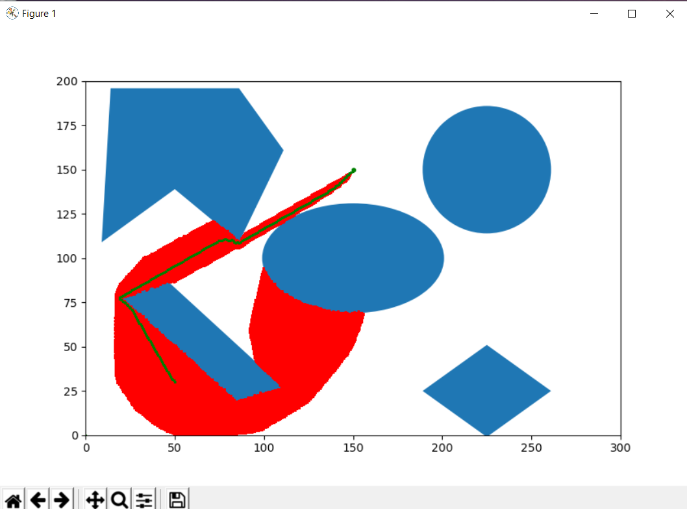
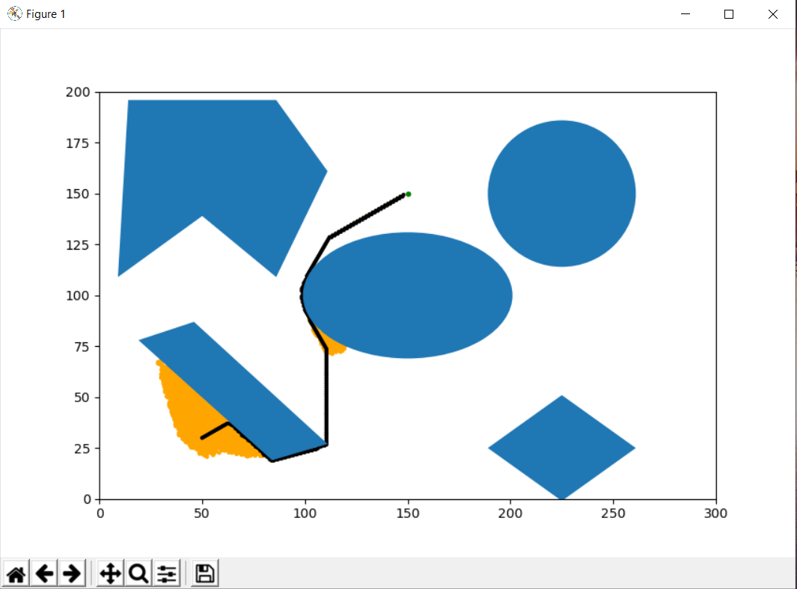

# Implementation-of- A-Star -algorithm
### Description
Implementation of A* algorithm is tested on a obstacle space for rigid robot. The robot will maneuver through the obstacle space to reach the goal point with minimum cost. For rigid robot, the dimension of the robot is also considered and world space is converted into configuration space by increasing the scale of the obstacles and converting the rigid robot into point robot.

### Actions
There are five acions carried out to make the robot reach the goal point:
1. firstAction
2. secondAction
3. thirdAction
4. fourthAction
5. fifthAction


### Dependencies 
python -version 3   

### Library
Numpy
math
matplotlib
cv2
glob
time

### Run Code
Enter the following to run the Astar for rigid robot.

```
cd [to 'codes' directory]
python3 Astar_rigid.py  for Linux   --updated filename::use  Astar_rigid_with_weight.py to run second code

python Astar_rigid.py   for Windows  --updated filename::use  Astar_rigid_with_weight.py to run second code
```

### Input Instruction:
As soon as you run the program, the following prompt occurs in the command window:
```
Enter the Radius of the Rigid body:

Enter the Clearance required for the Rigid body:

Enter the value of Start Node X co-ordinate:

Enter the value of Start Node Y co-ordinate:

Enter the value of Goal Node X co-ordinate:

Enter the value of Goal Node Y co-ordinate:

Enter the step size in range 1-10:

Enter the start angle in degrees:
```
For all these prompt please enter integers between 0 and 299 for X-coordinate and 0 and 199 for Y-coordinate.

Step Size: Enter value in range 1 to 10

Angle: Enter the Start angle (robot orientation) in degrees in the range 0 to 360

Please enter the elements of the matrix row wise typing enter


### Sample output for rigid robot:
After running the python file
```
Enter the Radius of the Rigid body:5

Enter the Clearance required for the Rigid body:5

Enter the value of Start Node X co-ordinate:50

Enter the value of Start Node Y co-ordinate:30

Enter the value of Goal Node X co-ordinate:195

Enter the value of Goal Node Y co-ordinate:295

Enter the step size in range 1-10:1

Enter the start angle in degrees:60

Entered input is out of bounds. Please enter a valid input!!

Enter the value of Goal Node X co-ordinate:150

Enter the value of Goal Node Y co-ordinate:150
Exploring nodes...
```
```
Cost took to reach the goal is: 156.20499351813308
Backtracking...
Total time taken 200 to 300 seconds -- updated code::The new code runtime is 10 t0 20 seconds(video generation takes 2+ hours).
```

### Output Video
The video was sampled at a frame rate of 500 frames per second and hence all the explored nodes are not displayed in the simulation video. This was done so as to generate the output video in a reasonable amount of time. An image of the final output is also attached which displays all the visited nodes.
--updated output:- added weight parameter to the heuristic function (2*Euclidean distance) to generate the new output attached in this file. 

### Output Images



### Note
For small distances, after finding the goal point the matplotlib will immediately start the simulation and reach the goal point. The goal exploration is not clearly see for small distances. For large distances it is clearly seen.


### Commits
Due to many test codes we could not make commits to the github repository.
